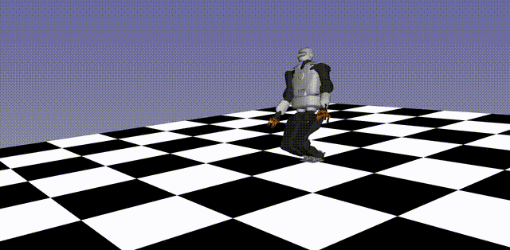

# Optimization_based_Control_of_Legged_Robotos

### Source:

https://github.com/andreadelprete/orc

https://github.com/stack-of-tasks/tsid

https://andreadelprete.github.io/courses/oclr/

https://www.youtube.com/playlist?list=PL4nPbSX5VFGhjPfdWK3nFhjtkY4yfjBnF

### General: Two  steps for Bipedal locomotion:

#### Offline:

1. Trejectory Optimization with contacts (rigid contacts, fix seqeuence left-right-left ...) using LPIM (Linear Inverse Pendulum Model) for generating a CoM reference trajectory for Bipedal Walking robot +generating trajectory for the feet

#### Online:

2. Reactive Control: TSID for tracking reference trajectory, Limits of TSID no notion of future states

### Model:

### Solve Optimization problem:

### Interpolation, LIPM to Whole-Body-Model, make  solution usable for TSID:

### Code general approach:

python3 Trajectory_Optimization/lipm_ocp.py

python3 Trajectory_Optimization/lipm_to_tsid.py

python3 Romeo_Walking/main.py

### Talos walking:

Generate an .npz archive file containing the discretized trajectories for TSID:

hw1_LIPM_to_TSID_template.py

hw1_tsid_biped_walking.py

