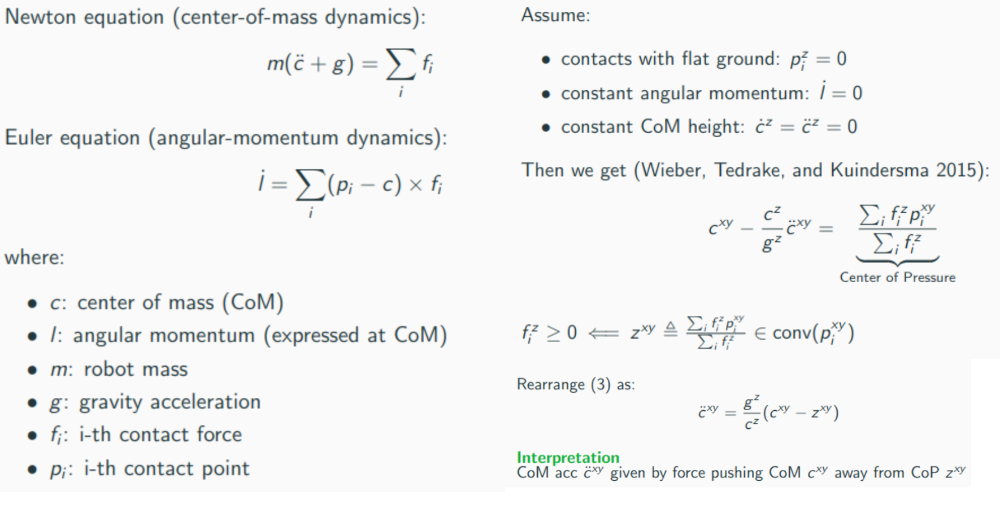
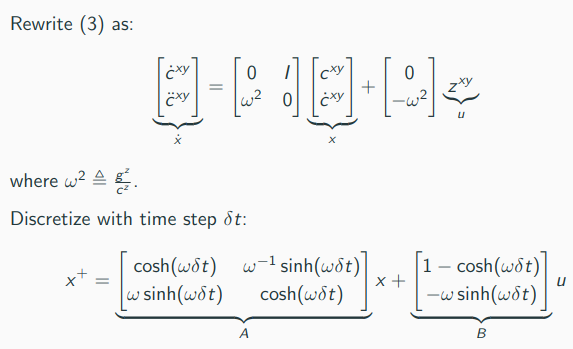
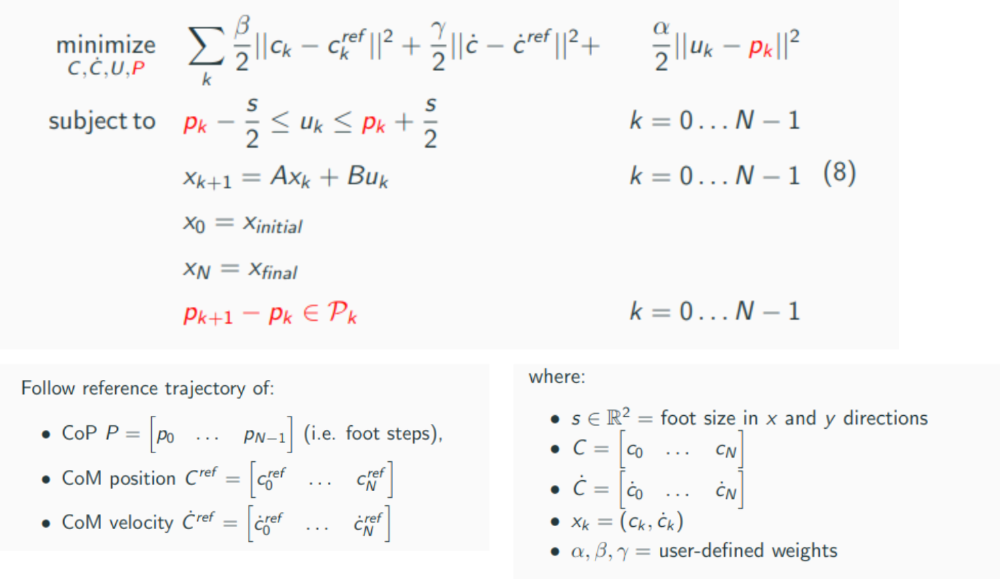
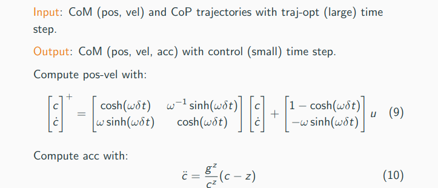
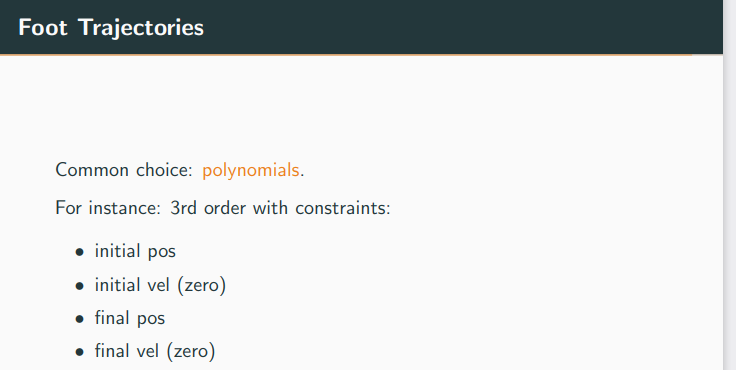
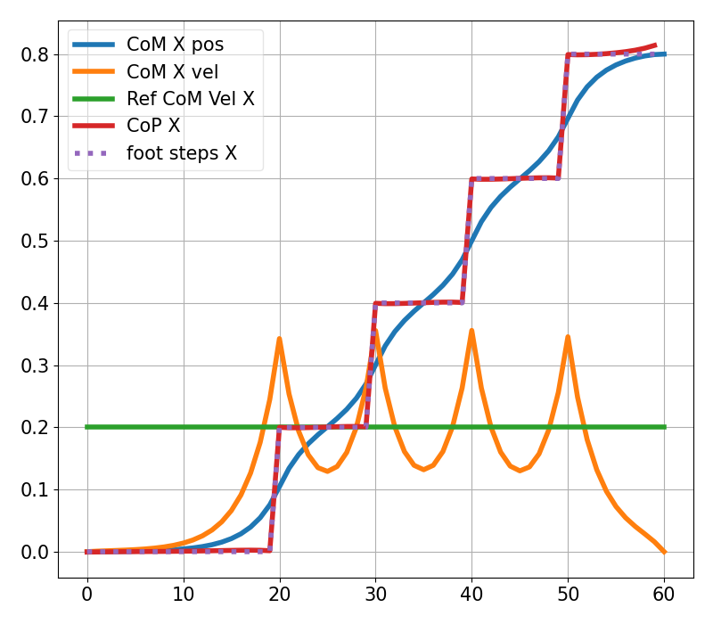
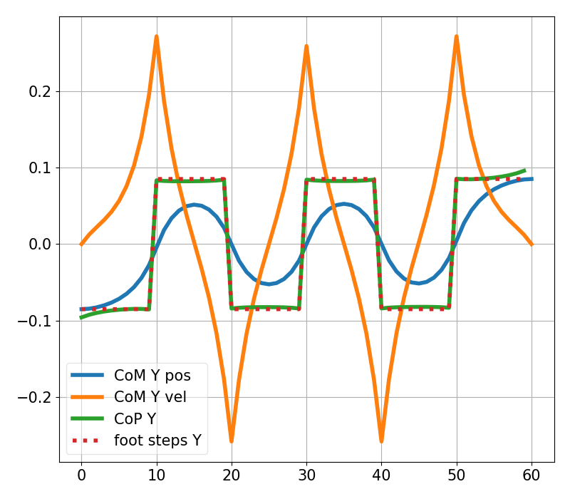
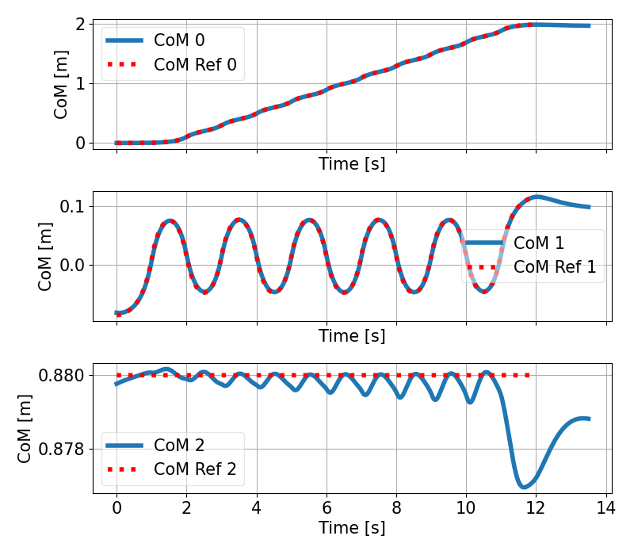
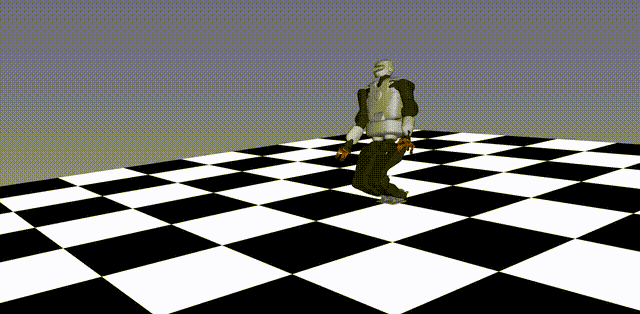

# Optimization_based_Control_of_Legged_Robotos

### Source:

https://github.com/andreadelprete/orc

https://github.com/stack-of-tasks/tsid

https://andreadelprete.github.io/courses/oclr/

https://www.youtube.com/playlist?list=PL4nPbSX5VFGhjPfdWK3nFhjtkY4yfjBnF

### General: Two  steps for Bipedal locomotion:

#### Offline:

1. Trejectory Optimization with contacts (rigid contacts, fix seqeuence left-right-left ...) using LPIM (Linear Inverse Pendulum Model) for generating a CoM reference trajectory for Bipedal Walking robot +generating trajectory for the feet

#### Online:

2. Reactive Control: TSID for tracking reference trajectory, Limits of TSID no notion of future states

### Model:

### Solve Optimization problem:

<pre style="font-size: 16px; font-weight: bold;">
    python3 Trajectory_Optimization/lipm_ocp.py
</pre>

### Interpolation, LIPM to Whole-Body-Model, make  solution usable for TSID:

- Optimized trajectory has large time step we need to interpolate

- We need a reference trajectory for the feets

Script for interpolation and foot trajectory and generates .npz files

<pre style="font-size: 16px; font-weight: bold;">
    python3 Trajectory_Optimization/lipm_to_tsid.py
</pre>

### Walking:

<pre style="font-size: 16px; font-weight: bold;">
    python3 Romeo_Walking/main.py
</pre>

### Talos walking_2:

1. Generate Reference Trajectory:

<pre style="font-size: 16px; font-weight: bold;">
    python3 lipm_ocp.py 
</pre>

    
    

X-Direction: Gradual advancement of the center of gravity following foot positions.

Y direction: Lateral compensatory movements of the center of gravity to maintain balance.

2. Linear Inverted Pendulum Model (LIPM), Model Predictive Control (MPC), Task-Space Inverse Dynamics (TSID):

<pre style="font-size: 16px; font-weight: bold;">
    python3 lipm_to_tsid.py 
</pre>

##### Compare CoM position:

### Talos walking_1:

Generate an .npz archive file containing the discretized trajectories for TSID:

<pre style="font-size: 16px; font-weight: bold;">
    hw1_LIPM_to_TSID_template.py
</pre>

<pre style="font-size: 16px; font-weight: bold;">
    hw1_tsid_biped_walking.py
</pre>

